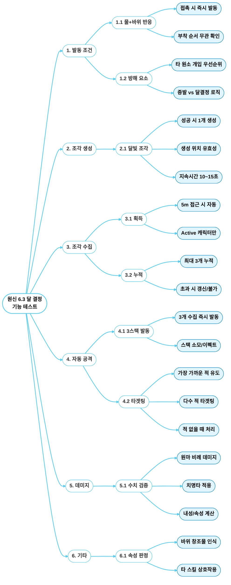

```mermaid
graph LR
    %% 전체 설정: 곡선형 엣지 사용
    linkStyle default interpolate basis stroke:#56CCF2,stroke-width:2px;

    %% 스타일 정의
    classDef root fill:#ffffff,stroke:#56CCF2,stroke-width:2px,color:#000,font-weight:bold;
    classDef node fill:#ffffff,stroke:#56CCF2,stroke-width:1px,color:#333;
    classDef leaf fill:#e1f5fe,stroke:#0288d1,stroke-width:1px,color:#000;

    %% 루트 노드
    Root([원신 6.3 달 결정<br/>기능 테스트]):::root

    %% 1. 발동 조건
    Root --> Cond([1. 발동 조건]):::node
    Cond --> Cond1([1.1 물+바위 반응]):::node
    Cond1 --> Cond1_1([접촉 시 즉시 발동]):::leaf
    Cond1 --> Cond1_2([부착 순서 무관 확인]):::leaf
    
    Cond --> Cond2([1.2 방해 요소]):::node
    Cond2 --> Cond2_1([타 원소 개입 우선순위]):::leaf
    Cond2 --> Cond2_2([증발 vs 달결정 로직]):::leaf

    %% 2. 조각 생성
    Root --> Gen([2. 조각 생성]):::node
    Gen --> Gen1([2.1 달빛 조각]):::node
    Gen1 --> Gen1_1([성공 시 1개 생성]):::leaf
    Gen1 --> Gen1_2([생성 위치 유효성]):::leaf
    Gen1 --> Gen1_3([지속시간 10~15초]):::leaf

    %% 3. 조각 수집
    Root --> Col([3. 조각 수집]):::node
    Col --> Col1([3.1 획득]):::node
    Col1 --> Col1_1([5m 접근 시 자동]):::leaf
    Col1 --> Col1_2([Active 캐릭터만]):::leaf
    
    Col --> Col2([3.2 누적]):::node
    Col2 --> Col2_1([최대 3개 누적]):::leaf
    Col2 --> Col2_2([초과 시 갱신/불가]):::leaf

    %% 4. 자동 공격
    Root --> Atk([4. 자동 공격]):::node
    Atk --> Atk1([4.1 3스택 발동]):::node
    Atk1 --> Atk1_1([3개 수집 즉시 발동]):::leaf
    Atk1 --> Atk1_2([스택 소모/이펙트]):::leaf
    
    Atk --> Atk2([4.2 타겟팅]):::node
    Atk2 --> Atk2_1([가장 가까운 적 유도]):::leaf
    Atk2 --> Atk2_2([다수 적 타겟팅]):::leaf
    Atk2 --> Atk2_3([적 없을 때 처리]):::leaf

    %% 5. 데미지
    Root --> Dmg([5. 데미지]):::node
    Dmg --> Dmg1([5.1 수치 검증]):::node
    Dmg1 --> Dmg1_1([원마 비례 데미지]):::leaf
    Dmg1 --> Dmg1_2([치명타 적용]):::leaf
    Dmg1 --> Dmg1_3([내성/속성 계산]):::leaf

    %% 6. 기타
    Root --> Etc([6. 기타]):::node
    Etc --> Etc1([6.1 속성 판정]):::node
    Etc1 --> Etc1_1([바위 창조물 인식]):::leaf
    Etc1 --> Etc1_2([타 스킬 상호작용]):::leaf
```
